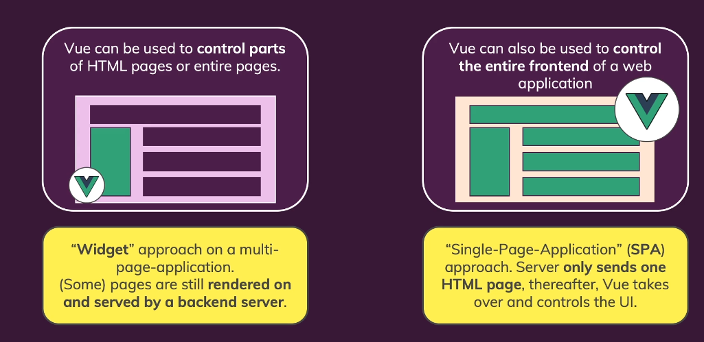
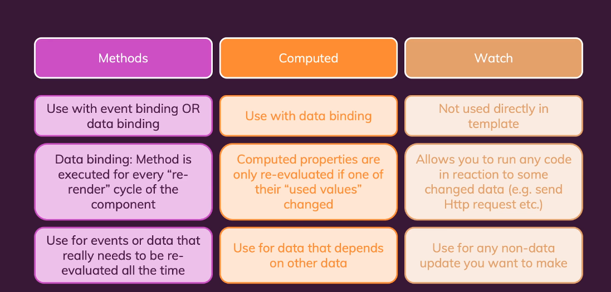
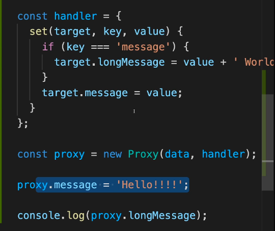
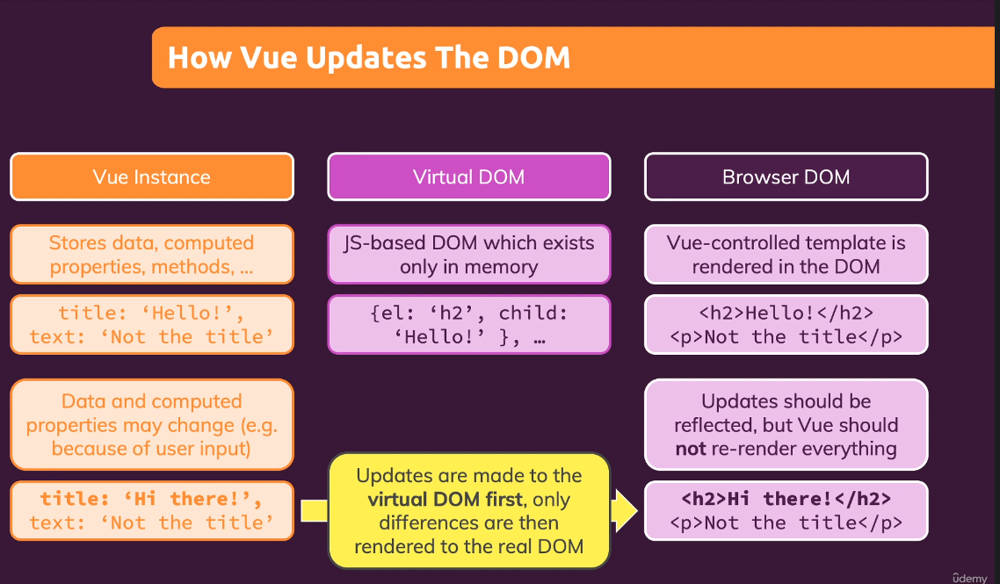
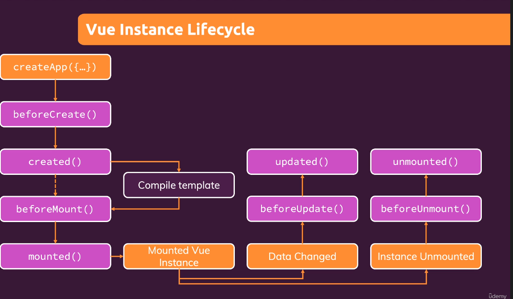
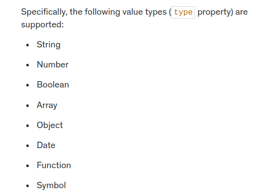
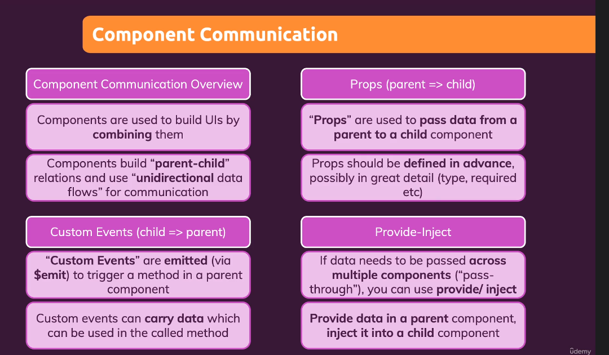
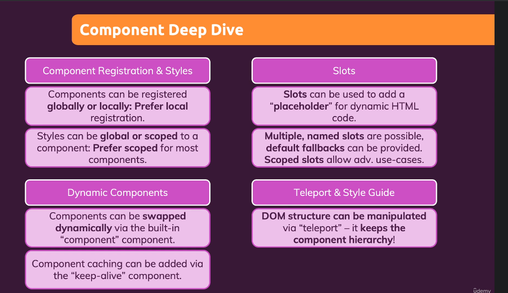

# Comparação entre Vue.js, Angular e React

## Vue.js

**Características:**
- Framework progressivo.
- Utiliza uma abordagem baseada em componentes.
- Suporte a templates e a diretivas.

**Vantagens:**
- Fácil de aprender e integrar em projetos existentes.
- Boa documentação.
- Flexível e leve.
- possui routing e tem mais recursos que o react, que depende de pacotes da 
comunidade, ao contrario do vue que vem com tudo já integrado.

**Desvantagens:**
- Menos maduro que Angular e React.
- Comunidade e ecossistema menores em comparação.
- Angular possui mais recursos (mais muito pesado para grandes projetos)
---

## Resumo das Diferenças
- **Vue.js**: mais leve e fácil para iniciantes, ideal para integração em projetos existentes.
- **Angular**: framework completo, melhor para aplicações grandes, mas mais complexo.
- **React**: biblioteca flexível e altamente popular, mas requer escolhas adicionais de arquitetura.

a primeira opção é por exemplo só utilziar vue em um chat em parte da tela

modo imperativo é a forma tradicional, selecionar um botão pelo id, e atribuir uma função
ao metodo onclick por exemplo
com vue, defino o resultado final desejado e os dados que serão necessários para ele

vue behind the scenes, turns ur data objeto into a reactive data object
wraping your properties with javascpript feature called proxys
https://developer.mozilla.org/en-US/docs/Web/JavaScript/Reference/Global_Objects/Proxy

u can have multiple apps in a single javasscript file
u can pass a template (a html content to put inside the selector as a string)
lin '
 test 
'

If you control multiple, independent parts of HTML pages, you will often work with multiple Vue apps (i.e. you create multiple apps by calling createApp() more than once).

On the other hand, if you're building a SPA, you typically work with just one "root app" (i.e. createApp() is only used once in your entire codebase) and you instead build up a user interface with multiple components.

You absolutely are allowed to also use components in cases where you have multiple Vue apps but you typically won't use multiple Vue apps if you build one big connected user interface.

sudo apt install nodejs
sudo apt install npm
sudo nodejs -v
sudo npm -v
sudo npm install -g @vue/cli
vue create vue-first-app
cd vue-first-app
npm run serve
npm install

avaliar no lugar vue cli
npm init vue

Props and events added on a custom component tag automatically fall through to the root component in the template of that component. In the above example, type and @click get added to the <button> in the BaseButton component.

You can get access to these fallthrough props on a built-in $attrs property (e.g. this.$attrs).

if u use a componente oly once the name shoube be TheSideBar and not SideBar
its better to create subfolders in components folder

